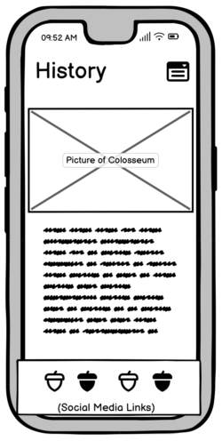

# Learn About the Colosseum
The purpose of this website is to give information to those who are interested in the Colosseum. The landing page has some quick facts to get the user engaged and the History and Gladiator section go more indepth into the creation of the structure, how it was used and the combatants that fought in it.

The main goal is to educate the user on the Colosseum but the secondary goal is for the user to visit, or possibly re-visit the Colosseum. The information on the first three pages will hopefully entice the user to consider visiting. The Visit page will give the user specific reasons to visit the Colosseum and a form if they have any questions about tours or general questions.


## UX

The design of the website is trying to evoke the image of ancient Rome with dark orange colours to represent sand and brick of the Colosseum.

### Colour Scheme


- `#c17226` used for primary text.
- `#E84610` used for primary highlights.
- `#ad5500` used for secondary text.
- `#fafafa` used for secondary highlights.

### Typography

Philiosopher and Mulish fonts were used as they pair well together and fit the theme. They were taken from Google Fonts. The social media links were taken from Font Awesome. l

- [Philiosopher](https://fonts.google.com/specimen/Philosopher?query=philosopher) was used for the primary headers and titles.

- [Mulish](https://fonts.google.com/specimen/Mulish?query=Mulish) was used for all other secondary text.

- [Font Awesome](https://fontawesome.com) icons were used as the social media icons in the footer.

## User Stories

In this section, list all of your user stories for the project.

### New Site Users

- As a new site user, I would like to see the title of the page at the top, so that I can always know what page I'm on.
- As a new site user, I would like to have a navigation bar, so that I can navigate to each page easily.
- As a new site user, I would like to have a form section, so that I can send a question to the site creator.
- As a new site user, I would like to have a confirmation page, so that I can know my question was sent correctly.

## Wireframes

For this site I created wireframes to give me a rough guide for the actual site.

To follow best practice, wireframes were developed for mobile, tablet, and desktop sizes.
I've used [Balsamiq](https://balsamiq.com/wireframes) to design my site wireframes.

### Home Page Wireframes

| Size | Screenshot |
| --- | --- |
| Mobile |  |
| Tablet |  |
| Desktop |  |

### History Page Wireframes

| Size | Screenshot |
| --- | --- |
| Mobile |  |
| Tablet |  |
| Desktop |  |

### Gladiator Page Wireframes

| Size | Screenshot |
| --- | --- |
| Mobile |  |
| Tablet |  |
| Desktop |  |

### Visit Page Wireframes

| Size | Screenshot |
| --- | --- |
| Mobile |  |
| Tablet |  |
| Desktop |  |

### Confirmation Page Wireframes

| Size | Screenshot |
| --- | --- |
| Mobile |  |
| Tablet |  |
| Desktop |  |


## Features
### Existing Features

- **Nav Bar/Title**

    - Each page has a title to show the user what page they are on. The navigation bar below the heading allows the use to quickly navigate to other parts of the site. Each link will change its background colour on hover to give visual feedback to the user about the link they are about to click.


- **Burger Menu**

    - If the site is on a screen below 600px width then the nav bar will become a burger menu. This will allow the user to quickly navigate to other parts of the site when needed but will not take up excessive space when the nav bar is not being used.


- **Greyscale**

    - Each page has multiple images to keep the user engaged and to give them a visual reference. The greyscale adds a touch of interactivity to the user.

    

    - **Timeline**

    - On the index page there is a timeline to at the bottom of the page to give the user a easy to read visual aid to give them a brief overview of the Colosseum before they go to the more in depth sections.

    

    - **Information**

    - The main purpose of the site is to allow users to learn about the Colosseum. Detailed information blocks with images will help the user learn more about the structure and its history.

     

    - **Footer**

    - The footer on each page is clearly marked with a colour change. The icons in the footer use clear icons as links so that the user can quickly navigate to different social media platforms.


- **Form**

    - The visit page has a form for users to fill in if they have any questions about the Colosseum or how to visit. 


- **Confirmation Page**

    - To assure the user their question has been sent a confirmation page will thank them and confirm the message has been sent.


### Future Features

- Quiz Page #1
    - In the future I think it would be fun to have a quiz section for users to test what they have learned.
- Image carousel #2
    - I would like to add an image carousel to the index page so that users could scroll through more images.

    ## Tools & Technologies Used

- [HTML](https://en.wikipedia.org/wiki/HTML) used for the main site content.
- [CSS](https://en.wikipedia.org/wiki/CSS) used for the main site design and layout.
- [TinyPNG.com](https://tinypng.com) used to compress image sizes.
- [writer.com](https://writer.com/grammar-checker/) used to check the grammar.
- [balsamiq.com](https://balsamiq.com/) used to create the wireframes.
- [CSS Flexbox](https://www.w3schools.com/css/css3_flexbox.asp)
- [JavaScript](https://www.javascript.com) used for burger menu on mobile devices.
- [Git](https://git-scm.com) used for version control. (`git add`, `git commit`, `git push`)
- [GitHub](https://github.com) used for secure online code storage.
- [GitHub Pages](https://pages.github.com) used for hosting the deployed front-end site.
- [Gitpod](https://gitpod.io) used as a cloud-based IDE for development.
- [Markdown Builder by Tim Nelson](https://traveltimn.github.io/readme-builder) used to help generate the Markdown files.


## Testing

For all testing, please refer to the [TESTING.md](TESTING.md) file.

## Deployment

The site was deployed to GitHub Pages. The steps to deploy are as follows:

In the GitHub repository, navigate to the Settings tab
From the source section drop-down menu, select the Main Branch, then click "Save".
The page will be automatically refreshed with a detailed ribbon display to indicate the successful deployment.
The live link can be found here

Local Deployment
This project can be cloned or forked in order to make a local copy on your own system.

Cloning
You can clone the repository by following these steps:

Go to the GitHub repository
Locate the Code button above the list of files and click it
Select if you prefer to clone using HTTPS, SSH, or GitHub CLI and click the copy button to copy the URL to your clipboard
Open Git Bash or Terminal
Change the current working directory to the one where you want the cloned directory
In your IDE Terminal, type the following command to clone my repository:
git clone https://github.com/tpfk7/Portfolio-1-Project-Submission.git
Press Enter to create your local clone.
Alternatively, if using Gitpod, you can click below to create your own workspace using this repository.

Open in Gitpod

Please note that in order to directly open the project in Gitpod, you need to have the browser extension installed. A tutorial on how to do that can be found here.

Forking
By forking the GitHub Repository, we make a copy of the original repository on our GitHub account to view and/or make changes without affecting the original owner's repository. You can fork this repository by using the following steps:

Log in to GitHub and locate the GitHub Repository
At the top of the Repository (not top of page) just above the "Settings" Button on the menu, locate the "Fork" Button.
Once clicked, you should now have a copy of the original repository in your own GitHub account!
Local VS Deployment
Use this space to discuss any differences between the local version you've developed, and the live deployment site on GitHub Pages.


## Credits 


### Content 


### Media


# PORTFOLIO 1 PROJECT SUBMISSION

In this section, you will include a few paragraphs providing an overview of your project.
Essentially, this part is your "sales pitch".

At this stage, you should have a name for your project so use it!
Don't introduce the project as a "portfolio project" for the diploma.

In this section, describe what the project hopes to accomplish, who it is intended to target, and how it will be useful to the target audience.

Consider adding a mockup image using the "Am I Responsive" website.
Here's your deployed site as an example:
https://ui.dev/amiresponsive?url=https://tpfk7.github.io/Portfolio-1-Project-Submission

Screenshots for the README and testing should not be inside of `assets/` or `static/` image folders.
(reminder: `assets/` and `static/` are for files used on the live site, not documentation)
Consider adding a new folder called `documentation`, and add the amiresponsive screenshot inside of that folder.
To add the image into your README, use this format:
(assuming you have a new folder called `documentation` with an image called "mockup.png")


Note: Markdown files (.md) should not contain HTML elements like `img`, `br`, `div`, `a`, etc, only Markdown formatting.
Find out more about using Markdown elements here:
https://pandao.github.io/editor.md/en.html

## UX

In this section, you will briefly explain your design processes.

### Colour Scheme

Explain your colours and the colour scheme.

- `#000000` used for primary text.
- `#E84610` used for primary highlights.
- `#4A4A4F` used for secondary text.
- `#009FE3` used for secondary highlights.

Consider adding a link and screenshot for your colour scheme using "coolors".
https://coolors.co/generate

When you add a colour to the palette, the URL is dynamically updated, making it easier for you to return back to your colour palette later if needed.

Example:

I used [coolors.co](https://coolors.co/e84610-009fe3-4a4a4f-445261-d63649-e6ecf0-000000) to generate my colour palette.


If you've used CSS `:root` variables, consider also including a code snippet here!

I've used CSS `:root` variables to easily update the global colour scheme by changing only one value, instead of everywhere in the CSS file.

```css
:root {
    /* P = Primary | S = Secondary */
    --p-text: #000000;
    --p-highlight: #E84610;
    --s-text: #4A4A4F;
    --s-highlight: #009FE3;
    --white: #FFFFFF;
    --black: #000000;
}
```

### Typography

Explain any fonts and icon libraries used, like Google Fonts and/or Font Awesome.

Consider adding a link to each font used, and the Font Awesome site if used (or similar icon library).

Example:

- [Montserrat](https://fonts.google.com/specimen/Montserrat) was used for the primary headers and titles.

- [Lato](https://fonts.google.com/specimen/Lato) was used for all other secondary text.

- [Font Awesome](https://fontawesome.com) icons were used throughout the site, such as the social media icons in the footer.

## User Stories

In this section, list all of your user stories for the project.

### New Site Users

- As a new site user, I would like to ____________, so that I can ____________.
- As a new site user, I would like to ____________, so that I can ____________.
- As a new site user, I would like to ____________, so that I can ____________.
- As a new site user, I would like to ____________, so that I can ____________.
- As a new site user, I would like to ____________, so that I can ____________.

### Returning Site Users

- As a returning site user, I would like to ____________, so that I can ____________.
- As a returning site user, I would like to ____________, so that I can ____________.
- As a returning site user, I would like to ____________, so that I can ____________.
- As a returning site user, I would like to ____________, so that I can ____________.
- As a returning site user, I would like to ____________, so that I can ____________.

### Site Admin

- As a site administrator, I should be able to ____________, so that I can ____________.
- As a site administrator, I should be able to ____________, so that I can ____________.
- As a site administrator, I should be able to ____________, so that I can ____________.
- As a site administrator, I should be able to ____________, so that I can ____________.
- As a site administrator, I should be able to ____________, so that I can ____________.

## Wireframes

In this section, display your wireframe screenshots using a Markdown `table`.

Instructions on how to do Markdown `tables` start on line #213 on this site: https://pandao.github.io/editor.md/en.html

To follow best practice, wireframes were developed for mobile, tablet, and desktop sizes.
I've used [Balsamiq](https://balsamiq.com/wireframes) to design my site wireframes.

### Home Page Wireframes

| Size | Screenshot |
| --- | --- |
| Mobile |  |
| Tablet |  |
| Desktop |  |

### About Page Wireframes

| Size | Screenshot |
| --- | --- |
| Mobile |  |
| Tablet |  |
| Desktop |  |

### Contact Page Wireframes

| Size | Screenshot |
| --- | --- |
| Mobile |  |
| Tablet |  |
| Desktop |  |

Repeat for any addition wireframe pages you have.

## Features

In this section, you should go over the different parts of your project,
and describe each in a sentence or so.

You will need to explain what value each of the features provides for the user,
focusing on who this website is for, what it is that they want to achieve,
and how your project is the best way to help them achieve these things.

For some/all of your features, you may choose to reference the specific project files that implement them.

IMPORTANT: Remember to always include a screenshot of each individual feature!

### Existing Features

- **Feature #1**

    - Details about this particular feature, including the value to the site, and benefit for the user. Be as detailed as possible!


- **Feature #2**

    - Details about this particular feature, including the value to the site, and benefit for the user. Be as detailed as possible!


- **Feature #3**

    - Details about this particular feature, including the value to the site, and benefit for the user. Be as detailed as possible!


Repeat as necessary for as many features as your site contains.

Hint: the more, the merrier!

### Future Features

Do you have additional ideas that you'd like to include on your project in the future?
Fantastic! List them here!
It's always great to have plans for future improvements!
Consider adding any helpful links or notes to help remind you in the future, if you revisit the project in a couple years.

- Cool new feature #1
    - Any additional notes about this feature.
- Cool new feature #2
    - Any additional notes about this feature.
- Cool new feature #3
    - Any additional notes about this feature.


## Deployment

The site was deployed to GitHub Pages. The steps to deploy are as follows:
- In the [GitHub repository](https://github.com/tpfk7/Portfolio-1-Project-Submission), navigate to the Settings tab 
- From the source section drop-down menu, select the **Main** Branch, then click "Save".
- The page will be automatically refreshed with a detailed ribbon display to indicate the successful deployment.

The live link can be found [here](https://tpfk7.github.io/Portfolio-1-Project-Submission)

### Local Deployment

This project can be cloned or forked in order to make a local copy on your own system.

#### Cloning

You can clone the repository by following these steps:

1. Go to the [GitHub repository](https://github.com/tpfk7/Portfolio-1-Project-Submission) 
2. Locate the Code button above the list of files and click it 
3. Select if you prefer to clone using HTTPS, SSH, or GitHub CLI and click the copy button to copy the URL to your clipboard
4. Open Git Bash or Terminal
5. Change the current working directory to the one where you want the cloned directory
6. In your IDE Terminal, type the following command to clone my repository:
	- `git clone https://github.com/tpfk7/Portfolio-1-Project-Submission.git`
7. Press Enter to create your local clone.

Alternatively, if using Gitpod, you can click below to create your own workspace using this repository.

[](https://gitpod.io/#https://github.com/tpfk7/Portfolio-1-Project-Submission)

Please note that in order to directly open the project in Gitpod, you need to have the browser extension installed.
A tutorial on how to do that can be found [here](https://www.gitpod.io/docs/configure/user-settings/browser-extension).

#### Forking

By forking the GitHub Repository, we make a copy of the original repository on our GitHub account to view and/or make changes without affecting the original owner's repository.
You can fork this repository by using the following steps:

1. Log in to GitHub and locate the [GitHub Repository](https://github.com/tpfk7/Portfolio-1-Project-Submission)
2. At the top of the Repository (not top of page) just above the "Settings" Button on the menu, locate the "Fork" Button.
3. Once clicked, you should now have a copy of the original repository in your own GitHub account!

### Local VS Deployment

Use this space to discuss any differences between the local version you've developed, and the live deployment site on GitHub Pages.

## Credits

In this section you need to reference where you got your content, media, and extra help from.
It is common practice to use code from other repositories and tutorials,
however, it is important to be very specific about these sources to avoid plagiarism.

### Content

Use this space to provide attribution links to any borrowed code snippets, elements, or resources.
A few examples have been provided below to give you some ideas.

Ideally, you should provide an actual link to every resource used, not just a generic link to the main site!

| Source | Location | Notes |
| --- | --- | --- |
| [Markdown Builder by Tim Nelson](https://traveltimn.github.io/readme-builder) | README and TESTING | tool to help generate the Markdown files |
| [Chris Beams](https://chris.beams.io/posts/git-commit) | version control | "How to Write a Git Commit Message" |
| [W3Schools](https://www.w3schools.com/howto/howto_js_topnav_responsive.asp) | entire site | responsive HTML/CSS/JS navbar |
| [W3Schools](https://www.w3schools.com/howto/howto_css_modals.asp) | contact page | interactive pop-up (modal) |
| [W3Schools](https://www.w3schools.com/css/css3_variables.asp) | entire site | how to use CSS :root variables |
| [Flexbox Froggy](https://flexboxfroggy.com/) | entire site | modern responsive layouts |
| [Grid Garden](https://cssgridgarden.com) | entire site | modern responsive layouts |
| [StackOverflow](https://stackoverflow.com/a/2450976) | quiz page | Fisher-Yates/Knuth shuffle in JS |
| [YouTube](https://www.youtube.com/watch?v=YL1F4dCUlLc) | leaderboard | using `localStorage()` in JS for high scores |
| [YouTube](https://www.youtube.com/watch?v=u51Zjlnui4Y) | PP3 terminal | tutorial for adding color to the Python terminal |
| [strftime](https://strftime.org) | CRUD functionality | helpful tool to format date/time from string |
| [WhiteNoise](http://whitenoise.evans.io) | entire site | hosting static files on Heroku temporarily |

### Media

Use this space to provide attribution links to any images, videos, or audio files borrowed from online.
A few examples have been provided below to give you some ideas.

If you're the owner (or a close acquaintance) of all media files, then make sure to specify this.
Let the assessors know that you have explicit rights to use the media files within your project.

Ideally, you should provide an actual link to every media file used, not just a generic link to the main site!
The list below is by no means exhaustive. Within the Code Institute Slack community, you can find more "free media" links
by sending yourself the following command: `!freemedia`.

| Source | Location | Type | Notes |
| --- | --- | --- | --- |
| [Pexels](https://www.pexels.com) | entire site | image | favicon on all pages |
| [Lorem Picsum](https://picsum.photos) | home page | image | hero image background |
| [Unsplash](https://unsplash.com) | product page | image | sample of fake products |
| [Pixabay](https://pixabay.com) | gallery page | image | group of photos for gallery |
| [Wallhere](https://wallhere.com) | footer | image | background wallpaper image in the footer |
| [This Person Does Not Exist](https://thispersondoesnotexist.com) | testimonials | image | headshots of fake testimonial images |
| [Audio Micro](https://www.audiomicro.com/free-sound-effects) | game page | audio | free audio files to generate the game sounds |
| [Videvo](https://www.videvo.net/) | home page | video | background video on the hero section |
| [TinyPNG](https://tinypng.com) | entire site | image | tool for image compression |

### Acknowledgements

Use this space to provide attribution to any supports that helped, encouraged, or supported you throughout the development stages of this project.
A few examples have been provided below to give you some ideas.

- I would like to thank my Code Institute mentor, [John/Jane Doe](https://github.com/username) for their support throughout the development of this project.
- I would like to thank the [Code Institute](https://codeinstitute.net) tutor team for their assistance with troubleshooting and debugging some project issues.
- I would like to thank the [Code Institute Slack community](https://code-institute-room.slack.com) for the moral support; it kept me going during periods of self doubt and imposter syndrome.
- I would like to thank my spouse/partner (John/Jane), for believing in me, and allowing me to make this transition into software development.
- I would like to thank my employer, for supporting me in my career development change towards becoming a software developer.